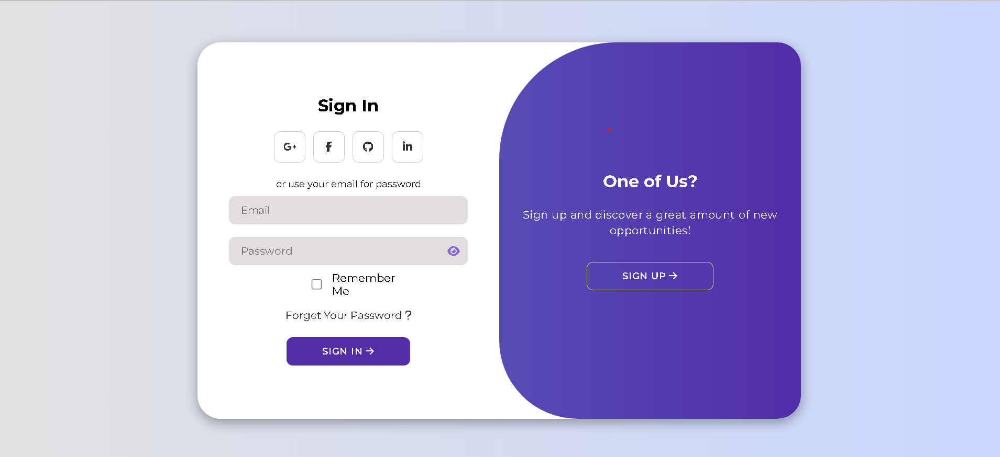

# Modern Login Page

This is a modern login page created using HTML, CSS, and JavaScript. It features a stylish and responsive design with sign-up and sign-in forms, social media login buttons, and password strength meter.

## Project Description

The project is a simple yet elegant login page that allows users to sign up or sign in. It includes a password visibility toggle, password strength meter, and social media login buttons. The page transitions smoothly between the sign-up and sign-in forms, providing a great user experience.

## Features

- **Responsive Design:** Works well on both desktop and mobile devices.
- **Password Strength Meter:** Displays the strength of the password entered during sign-up.
- **Password Visibility Toggle:** Allows users to show or hide their password.
- **Social Media Login:** Includes buttons for Google, Facebook, GitHub, and LinkedIn login (non-functional).
- **Smooth Transitions:** Smoothly transitions between the sign-up and sign-in forms.

## Installation

1. Clone the repository:
   ```sh
   git clone https://github.com/your-username/modern-login-page.git
2. Navigate to the project Directory:
    ```sh
    cd modern-login-page
3. Open `index.html` in your web Browser.

### Screenshot




### Links

- Solution URL: [Solution](https://github.com/bossthekhani/modern_login_page)


## My process

### Built with

- Semantic HTML5 markup
- CSS custom properties
- [Gooogle Fonts](https://fonts.google.com) - Montserrat 

## Usages
1. Open `index.html` in a web browser.
2. Use the toggle buttons to switch between the sign-up and sign-in forms.
3. Enter your details and submit the form. You will see an alert message indicating whether the sign-up/sign-in was successful.

### Code Overview
## HTML
The `index.html` file contains the structure of the login page with two forms (sign-up and sign-in) and a toggle container.
## CSS
The `mod.css` file contains the styles for the login page, including layout, colors, and animations.
## JS
The `mod.js` file contains the functionality for form submission, password visibility toggle, and password strength meter.

## Author

- Website - [Live Preview](https://www.your-site.com)
- Frontend Mentor - [@bossthekhani](https://www.frontendmentor.io/profile/bossthekhani)
- Instagram - [@bossthekhani](https://www.twitter.com/bossthekhani)

## Acknowledgments

This is where you can give a hat tip to anyone who helped you out on this project. Perhaps you worked in a team or got some inspiration from someone else's solution. This is the perfect place to give them some credit.

